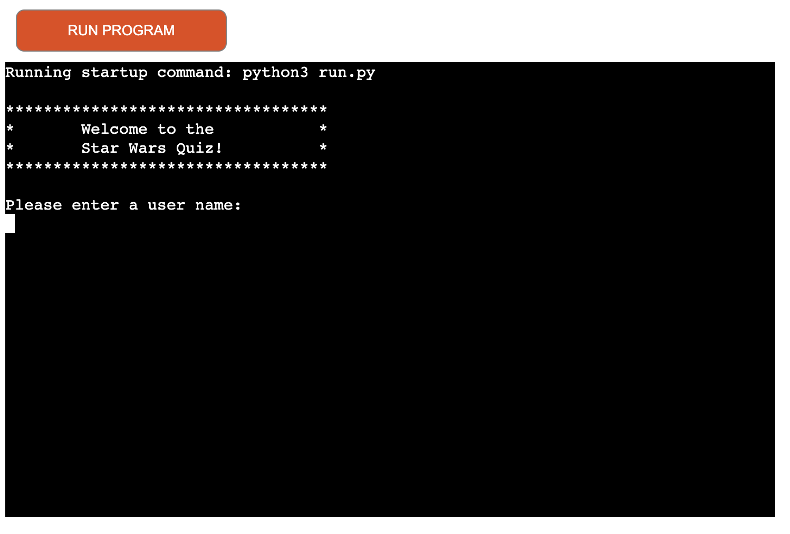

# Star Wars Quiz Game

The Star Wars Quiz Game is a fun and interactive command-line game designed to test your knowledge about the Star Wars universe. Built using Python, the game challenges players with a series of True/False questions and provides instant feedback on their answers.

### To play the live game [click here](https://starwars-quiz-01acf5a1c4b0.herokuapp.com/)

## Table of Contents
- [How to Play](#how-to-play)
- [Game Flow](#logic-flow-chart)
- [Features](#features)
- [Technologies](#technologies-used)
- [Testing](#testing)
- [Deployment](#deployment)
- [Credits](#credits)

## How to Play
Once the game starts, the user is asked if they want to read the game instructions or proceed directly to play. After deciding, the user is prompted to enter a username. The game will then present a series of True/False questions about the Star Wars universe. The user should try to answer all questions correctly to achieve the highest score. The game will provide feedback after each question and display the final score at the end.

## Game Flow
The design and flow of the game were carefully planned to ensure smooth gameplay. Key functions and their interactions were mapped out before coding began, ensuring a clear direction and seamless integration of features.

## Features
The current features of the game include:
- **Game Rules**: Instructions on how to play the game.
- **Username Input**: Allows for a personalized experience and tracks multiple players' scores.
- **Question Bank**: A series of True/False questions about the Star Wars universe.
- **Instant Feedback**: Provides feedback after each question, indicating whether the answer was correct or incorrect.
- **Final Score Display**: Shows the user's final score at the end of the game.

## Technologies
The following technologies were used in the development of this project:
- **GitHub**: Source control and project repository.
- **Codeanywhere**: Cloud development space for creating and testing the game.
- **Python**: The programming language used to build the game.
- **Heroku**: Deployment and hosting of the game.

## Testing
Comprehensive testing was conducted to ensure the game works correctly. Here are the details of the tests performed:

| Feature | Expected Outcome | Testing Performed | Result | Pass/Fail |
|---------|------------------|-------------------|--------|-----------|
| View Game Instructions | Display instructions or proceed to the next step based on user input | Tested 'Y' and 'N' inputs | Worked as expected | Pass |
| Enter Valid Username | Valid name starts the game, invalid name prompts an error | Input various names (valid and invalid) | Worked as expected | Pass |
| Personalized Welcome Message | Displays a welcome message with the username | Run the game with the usernames | Worked as expected | Pass |
| Answer Questions | Verifies and shows if the answer is correct | Input 'True' or 'False' for questions | Worked as expected | Pass |
| Final Score Display | Shows the final score at the end of the game | Complete the quiz | Worked as expected | Pass |

All code was validated using CI pip8 Python testing, with no issues except for warnings about long lines, which were acknowledged but left unchanged for readability.

## Deployment
The game was deployed using Heroku, with the following steps:
1. Login to Heroku.
2. Create a new app with a unique name and select a region.
3. Navigate to settings, reveal config vars, and add "PORT" with value "8000".
4. Add buildpacks for "Python" and "Node.js" ensuring Python is first.
5. Deploy the app from the linked GitHub repository and enable automatic deploys.

Play the Deployed Project [Here](https://starwars-quiz-01acf5a1c4b0.herokuapp.com/)

## Credits and Resources
- The code writing and game idea based and adapted from 100 Days of Code: The Complete Python Pro Bootcamp [Udemy](https://www.udemy.com/)
- The questions for the quiz sourced from [WhatCulture](https://whatculture.com/)
- Problem-solving and debugging assistance - [Stack Overflow](https://stackoverflow.co/)

